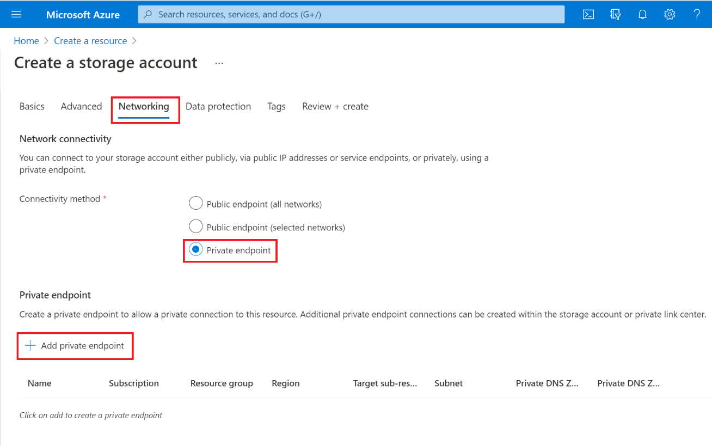
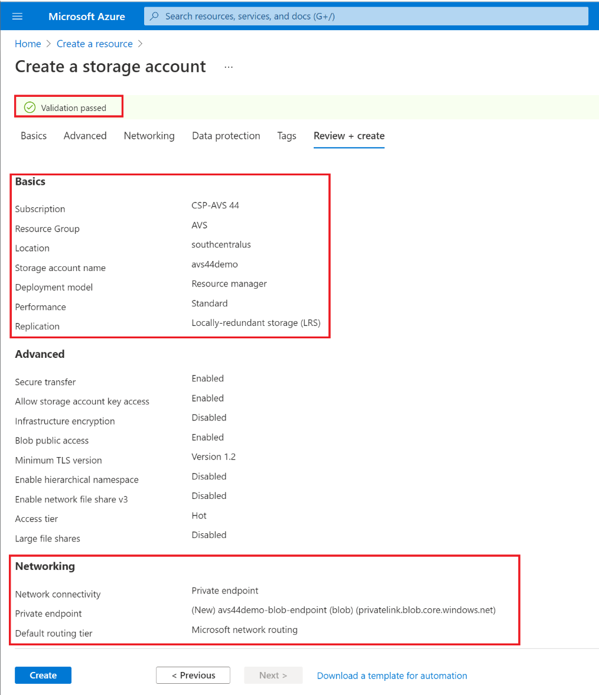
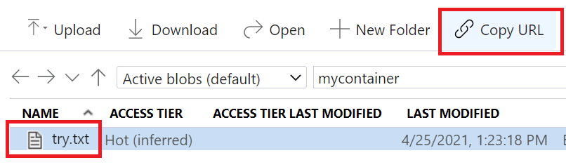

# LAB7 – Access Azure Storage Account through Azure Private Endpoint

One of the key advantages of having VMware workloads running on Azure VMware
Solution is the seamless integration with other Azure services. Communication
from AVS Private Cloud workloads to Azure services will be private and secure
through Azure Private Endpoint, which injects a Network Interface for Azure PaaS
Services in Azure vNet allowing the PaaS serving to have a private IP address,
that will facilitate local communication with AVS without the need for the
traffic to traverse through the Internet. Also, Azure Private DNS Zones will
close the gap by allowing the workloads to be configured with the normal Azure
Service endpoint URLs, where it the background these URLs will be translated to
private IP address of the PaaS service instead of the public endpoint.

So, let’s start the steps of creating and configuring an Azure Storage Account
that only allow traffic through the associated Azure Private Endpoint. And you
will enable Azure Private DNS Zone for the Private Endpoint to allow smooth name
resolution.

1. Go to Azure Portal home page, click on **Create a resource** button.

    

2. Select (or search for) **Storage account**.  

    

3. Fill out the main fields at the **Basics** section to start creating a new
   Storage account, such as **Subscription**, **Resource Group**, **Name**,
   etc. … Keep the same values in the other fields as you see below.  

   

4. Move to **Advanced** section, click **Next**.

5. Move to **Networking** section, and select **Private endpoint**. Then click
   on **+ Add private endpoint**.

   

6. Fill out the fields in **Create private endpoint** pane.

   1. Make sure to select the **Storage sub-resource**: **blob**.

   2. Make sure the **Location** of the Private endpoint is the same
      **region** of the **vNet** that’s connected to AVS Private Cloud. In the
      example below it is **South Central US**.

   3. Note that in this lab the **vNet** exists and is called **AVS-vNET** and
      the subnet for Private endpoint has also been created and called
      **PrivateLinkIntegration** which should show up in the drop-down list.

   4. Under **Private DNS integration**, make sure to select **Yes** for
      **Integrate with private DNS zone**. Since it didn’t exist in this
      environment, it will create a new instance.

      

7. Click Ok at the Create private endpoint pane, and you should see something
   similar to the following: 

8. Click on **Next** to move to **Tags** pane.

9. Click on **Next** to move to **Review + Create** pane. After validation is
   successful click on Create to create the Azure Storage Account with the
   associated Azure Private Endpoint and Azure Private DNS Zone.

   

10. It will take few minutes, and the deployment will be done. 

11. Go to the created Storage Account by clicking on its name, for example in
    the above screenshot it was **avs44demo**.

12. Go to **Networking** section on the **Storage Account** blade. There you
    will **temporarily** add a firewall exception for your IP so you can upload
    a file to the Storage account, and in a later step you will remove that
    firewall exception. 

13. Your IP should appear in the list there, like this:  
    

14. Click on Save button to save changes:  
    

15. Next, refresh your browser tab to make sure change has been reflected:  
    

16. Create a new blob container by going to **Storage Explorer** section and
    **right click** on **BLOB CONTAINERS**, then click on **Create blob
    container**.  
    

17. Give the container a name, and make sure the **Public access level** is set
    to **Blob (anonymous read access for blobs only)**, then click on **Create**
    button.  
    

18. Create a text file (.txt) name it as you want and type any text in it. Try
    to make it unique so you can notice the content in later steps. For example:

    

19. Upload the created text file (try.txt) to the blob container that you just
    created.

20. Copy and store the URL of that text file blob as you will be using it in
    future steps. This how you do
    it:  
    The URL will look like this:
    <https://avs44demo.blob.core.windows.net/mycontainer/try.txt>

21. Let’s now remove the Firewall exception that you added earlier, as it is no
    longer needed. By going to **Networking** and **deleting** your IP address,
    then click on **Save** button to save
    changes.

22. NOW, is testing time!

    1. So, if you go back to the VM you created earlier. Try to run
       **nslookup** to the Storage Account URL, you’ll notice that you are
       getting back the **Private Endpoint IP**, that IP is an **internal** IP
       belongs to the PrivateLinkIntegration Subnet in AVS-vNET.

       nslookup avs44demo.blob.core.windows.net

    2. You can also do curl to the blob URL and see that you can view the
       content, where if you access the URL from your workstation browser,
       you’ll not be able to get to it.

       curl <https://avs44demo.blob.core.windows.net/mycontainer/try.txt>

       

    3. This is what you get when you try to access the URL from your
       workstation (or any device outside of your AVS Private Cloud scope)

       

**As you just noticed, from a VM hosted on AVS you were able to retrieve a blob
privately and securely from Azure Storage account without exposing the Storage
account to the Internet. Of course, that came out as a result of integrating
with Azure Private Endpoint, Private DNS Zones and the DNS Forwarding mechanism
you configured in previous lab.**

**The good news, this is not exclusive to Storage Account. You can do the same
with other Azure Services like, Azure SQL, Azure KeyVault, Azure Monitor, Azure
Automation Account, etc.… (basically any service that has an integration with
Private Endpoint).**

## Next Steps

[Back to Table of Content](toc.md#table-of-contents)

[Lab 8](lab-8.md)
