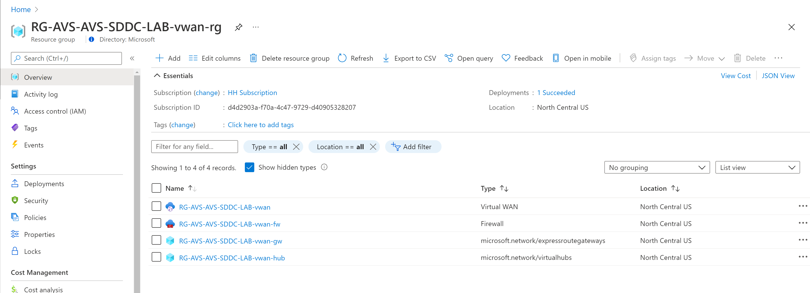

# LAB8 – \*Enable Public IP for AVS

> This step has been performed part of pre-provisioning the lab environment.  
> 
> However, it is still helpful to understand the steps that has been taken.

After connecting and accessing your AVS lab from a Windows Jumpbox connected to
an Azure VNET the next logical step would be to setup the integration with
Virtual WAN, and Azure VMware Solution comes out of the box with a mechanism to
easily setup it. The result of this integration is to eventually allow
configuring inbound Internet traffic to VMs hosted at AVS Private Cloud.

1. Access AVS from Azure portal and in the **Connectivity** pane, select the
   **Public IP** tab and click on **Configure**.

1. Enter the address block for the **Virtual Hub**, make sure this network
   segment does not overlap with your existing networks, and the number of
   Public IP addresses, this number goes up to 100. Click on **Create**.

> The operation can take up to **one hour** as you see in the screenshot
> below. Because it will be deploying other resources such as Azure vWAN and
> Azure Firewall then configure Express Route Connection.

1. You can monitor the status of the deployment from Azure portal.
   
   By default, a new Resource Group will be created part of provisioning Azure
   vWAN, vWan Hub and Azure Firewall. So, you can go directly to that Resource
   Group and check the deployment status. The name of that Resource Group will
   end with “-vwan-rg”.

1. Verify status of the provisioned VWAN and VWAN Hub directly from the same
   **Public IP** tab in your Private Cloud **Connectivity** pane.

Also, by going to the created Resource Group you’ll notice these resources
created, and you can also see the status of the deployment itself and check that
it was completed successfully.

|  |  |
| ------------------------------------------------------------------------------------------------------------------------------------- | ------------------------------------------------------------------------------------------------------------------------------------- |

## Next Steps

[Back to Table of Content](toc.md#table-of-contents)

[Lab 9](lab-9.md)
