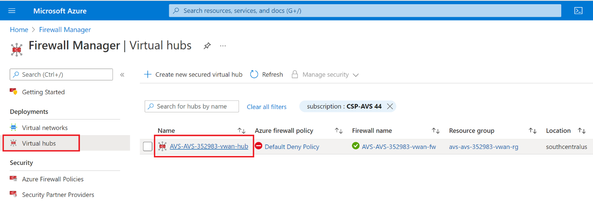
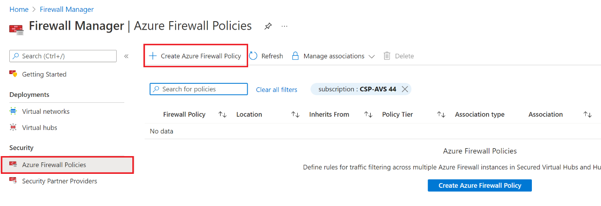
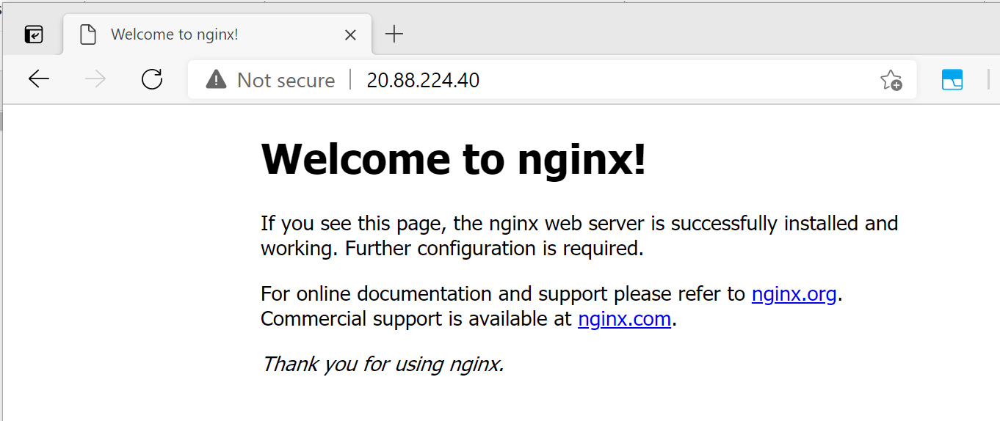

# LAB9 – Assign Public IP to virtual machine on Azure VMware Solution

Next, you will assign a Public IP address to the virtual machine. You will need
to create a Firewall Policy in the VWAN instance deployed in a previous lab.

1. In the Azure portal, search for and select **Firewall Manager**.

   

2. To view the available Public IPs that can be used when configuring the
   Firewall Policy. Click on **Virtual Hubs** on the left, then select the
   instance that **vWAN Hub instance** that was created for AVS.

   

   Click on **Public IP Configuration** to view all IPs, copy and take note for
   one of them as you’ll be using in next steps.

   

3. Go back to **Firewall Manager** blade, Select **Azure Firewall Policies**
   and then select **Create Azure Firewall Policy**.

   

4. Under the **Basics** tab, provide the required details and select **Next:
   DNS Settings**.

5. Under the **DNS** tab, select **Disable**, and then click on **Next: TLS
   inspection**.

6. Under the **TLS inspection** tab, click on **Next: Rules**.

7. Select **Add a rule collection**, provide the below details, and select
   **Add** and then select **Next: Threat intelligence**.

- Name

- Rules collection Type: **DNAT**

- Priority: (i.e., 1000)

- Name of rule

- Source Type: IP Address

- Source: \*

- Protocol: TCP

- Destination port: 80

- Destination Type: IP Address

- Destination: Public IP Address (that was copied from the earlier step –
  Step\#2)

- Translated address: AVS hosted Web Server (Photon OS VM - Nginx Server)
  private IP Address.

- Translated port: AVS hosted Web Server (Photon OS VM - Nginx Server) port
  (i.e.: 80)
  
  
  
  

1. Click on Add () button to add
   the Rule and move to **Review + Create** section. Then click **Create**
   button to create the Azure Firewall Policy. 

2. Now, the Azure Firewall **Policy is ready**, next step would be associate it
   with vWan Hub that’s linked to AVS. Go to **Azure Firewall Policies**,
   select the created policy, and click on **Manage associations**, choose
   **Associate hubs**.  
   

3. Select the Virtual Hub that is linked to AVS and click on **Add** button.

   

4. Wait for few minutes, then the Azure Firewall Policy you created will be
   associated with the virtual Hub that’s linked with AVS.
   

5. NOW, is testing time!

   Copy the IP that you initially configured in the Azure Firewall Policy, as
   it is now will be the Public IP of the assigned AVS hosted VM and put it
   your workstation browser address bar. Since that AVS hosted VM has Nginx
   Server deployed, you should be able to see the Nginx Server default page.

   

**As you noticed, you were able to publish a web server hosted on AVS VM
directly to the Internet by assigning it a public IP address through Azure
Firewall Policy.**

## Next Steps

[Back to Table of Content](toc.md#table-of-contents)

[Lab 10](lab-10.md)
