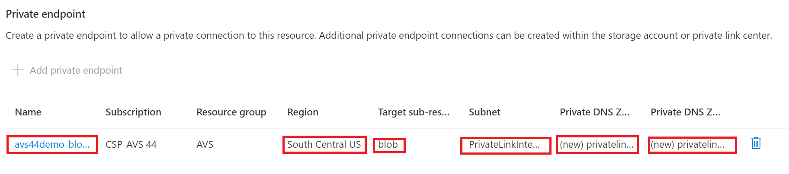
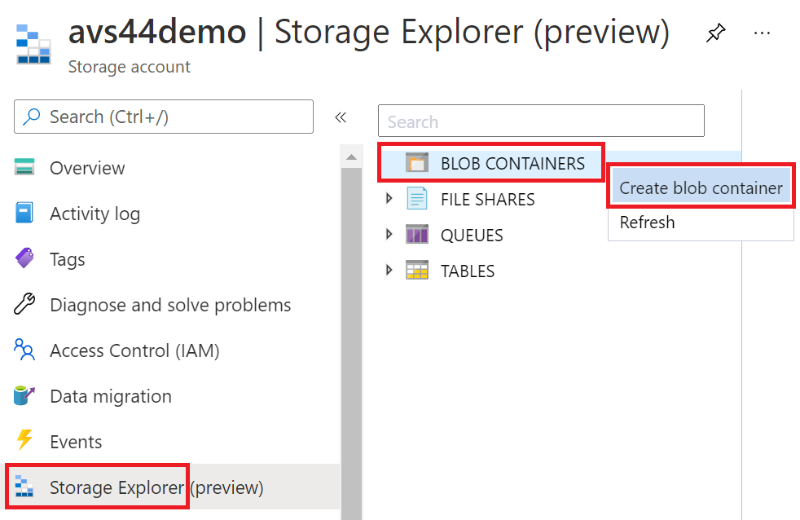
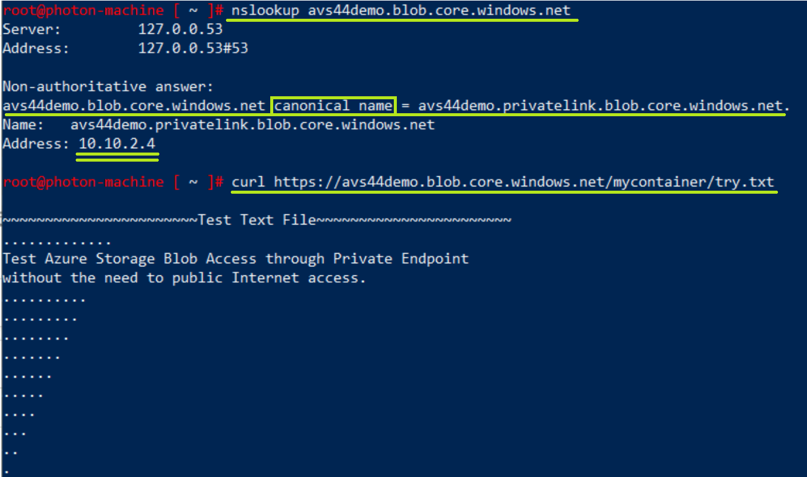

# Table of Contents

[Before the Training](before-the-training.md)

- [Microsoft Learn Module](before-the-training.md#microsoft-learn-module)
- [Capacity Planning (optional)](before-the-training.md#capacity-planning-optional)

[Expected Time Needed Per Lab](expected-time-needed-per-lab.md#expected-time-needed-per-lab)

- [Important Notes](expected-time-needed-per-lab.md#important-notes)

[Lab Environment](lab-environment.md#lab-environment)

- [Pre-provisioned Azure VMware Solution Environment](lab-environment.md#pre-provisioned-azure-vmware-solution-environment)

- [Lab Architecture Diagram](lab-environment.md#lab-architecture-diagram)
  
- [On-Premises Connectivity](lab-environment.md#on-premises-connectivity)
  
- [Resources](lab-environment.md#resources)
  
- [Architecture Diagram](lab-environment.md#architecture-diagram)

[Lab Objectives](lab-objectives.md)

[LAB1 – Azure VMware Solution Deployment](lab-1.md)

[LAB2 – Configure Private Cloud access    7](lab-2.md)

- [Jumpbox deployment    7](#_Toc70975348)

- [Azure Bastion configuration    9](#_Toc70975349)

- [Access the Private Cloud – Animation    11](#_Toc70975350)

- [Access the Private Cloud    12](#_Toc70975351)

[LAB3 – Initial NSX-T configuration    15](#_Toc70975352)

- [Create DHCP Server from Azure portal    15](#_Toc70975353)
- [Create NSX network segment from Azure portal    16](#_Toc70975354)
- [Configure DNS from Azure portal    18](#_Toc70975355)
  - [Step 1 - Configure a default DNS zone and FQDN zone    18](#_Toc70975356)
  - [Step 2 - Configure DNS service    20](#_Toc70975357)
  - [Step 3 - Configure DNS Forwarder    21](#_Toc70975358)

[LAB4 – Enable Internet Access to Azure VMware Solution](#_Toc70975359)

[LAB5 – Create content libraries    26](#_Toc70975360)

[LAB6 – Deploy a virtual machine on Azure VMware Solution](#_Toc70975361)

[LAB7 – Access Azure Storage Account through Azure Private Endpoint](#_Toc70975362)

[LAB8 – Enable Public IP for AVS](#_Toc70975363)

[LAB9 – Assign Public IP to virtual machine on Azure VMware Solution](#_Toc70975364)

[LAB10 – Connect from Azure Application Gateway to AVS hosted workload](#_Toc70975365)

[LAB11B – Scale an AVS Cluster](#_Toc70975366)

- [Add a new cluster](#_Toc70975367)
- [Scale a cluster](#_Toc70975368)

[LAB12B – Configure HCX (HoL)](#_Toc70975369)
[LAB13B – Configure Alerts and Notifications](#_Toc70975370)

- [Supported metrics and activities](#_Toc70975371)
- [Configure an alert rule](#_Toc70975372)
- [Work with metrics](#_Toc70975373)

[LAB14B – Create a remote content library in Azure Blob Storage](#_Toc70975374)

[APPENDIX 1 – Azure VMware Solution Deployment](#_Toc70975375)

- [Prerequisites](#_Toc70975376)
- [Create a Private Cloud](#_Toc70975377)

[APPENDIX 2 – Configure AVS Networking from NSX-T Manager](#_Toc70975378)

 [Create a DHCP server](#_Toc70975379)
 [Create network segment from NSX-T Manager](#_Toc70975380)

[APPENDIX 3 - Deploy VMware Photon OS OVA from URL](#_Toc70975381)

[APPENDIX 4 – Configure DNS Forwarding through Conditional Forwarders](#_Toc70975382)

# LAB4 – \*Enable Internet Access to Azure VMware Solution

> This step has been performed part of pre-provisioning the lab environment.  
> 
> However, it is still helpful to understand the steps that has been taken.

After you have deployed AVS Private Cloud. You can enable Internet Access from
your AVS workloads to the Internet by following the steps below. This operation
will take between 15-20 minutes.

Using an Internet Browser go to Azure Portal (<https://portal.azure.com>), then
search for “Azure VMware Solution”. Click on the instance you have previously
deployed, then under **Manage**, click on **Connectivity,** and select
**Settings**.

1. Under **Internet enabled**, you’ll see that it is **Disabled** by default.

1. Select **Enabled** and click **Save** button.

1. As mentioned, it will take between 15-20 minutes to apply the changes.

1. AVS Private Cloud properties cannot be modified during that time, as you
   notice in the message below (that you will see if you click on **Refresh**
   button)

1. After the configuration change has been applied you will be able to access
   to Internet from VMs deployed on AVS Private Cloud, and this is what you’ll
   see when the operation is completed.

**After you complete this step, you should be able to access Internet from VMs
running on AVS Private Cloud.**

# LAB5 – Create content libraries

[Content
libraries](https://docs.vmware.com/en/VMware-vSphere/6.7/com.vmware.vsphere.vm_admin.doc/GUID-254B2CE8-20A8-43F0-90E8-3F6776C2C896.html)
store and manage content in the form of library items. A single library item
consists of one or more files used to deploy virtual machines. These files can
be virtual machine templates or ISO images.

In this lab you are going to create a local content library, stored in the SDDC
vSAN storage and a remote one using Azure Blob Storage.

**Create a local content library**

1. Access vCenter and in the drop-down menu select **Content
   Libraries**.

2. Select the **Add** button to create a new content library.  
   

3. Enter the name for the library and select the AVS vCenter Server. Click
   Next. 

4. Under **Configure content library**, select **Local content library**. You
   can keep **Enable Published** un-checked.

5. In **Add Storage** select the vSAN datastore (**vsanDatastore**)

6. Click **Next**, verify the data and click **Finish**.

7. The new library will appear, select it and in the **Actions** menu select
   **Import item**. 

8. Enter the URL of the Photon OS OVA (below) or any other OVA/ISO you might
   have and click **Import**.
   <https://packages.vmware.com/photon/4.0/GA/ova/photon-hw13-uefi-4.0-1526e30ba0.ova>
   
    

9. You may get a note about the SSL certificate that signed the OVA file is not
   trusted. Choose the **Action \> Continue** when asked “SSL certificate from
   server packages.vmware.com cannot be trusted. Do you want to proceed?”  
   
   
   Then choose **Proceed Anyway**
   
   

10. After the OVA has been imported it will be available in the **Templates**
    area.

# LAB6 – Deploy a virtual machine on Azure VMware Solution

With your Azure VMware Solution Private Cloud deployed and configured the next
step would be to deploy a virtual machine on it.

You can do that in two ways, create the VM and install the operating system
manually or use an OVF/OVA appliance. You can follow this link to learn more
about OVF ([Open Virtualization Format](https://www.dmtf.org/standards/ovf))

For this lab you will use an OVA appliance since it is faster and easier. You
are going to deploy a Photon OS, which is a VMware owned and developed Linux
distribution. That can be done in two ways:

1. Deploy the OVA directly using a URL as a source. (See Appendix)

2. Deploy the OVA from Content Library.

It’s up to you to decide which way you want to proceed with. The natural flow is
to deploy from the Content Library since you already added the OVA to it in the
previous lab. But you are welcome to deploy from URL directly (see appendix).
After you start the deployment Wizard, the steps are common between both methods
as you will see.  

Deploy VMware Photon OS OVA Content Library

1. There are two ways to start this, by first going to **vCenter** portal from
   the **Jumpbox**:
   
   1. Start from the **Content Library**.
      
      1. In the **vCenter** portal, click on **Menu** and select **Content
         Libraries**.
      
      2. Select the Content Library that you want to take the OVA/ISO from,
         as you see below: 
      
      3. Select the OVA. For example: Photon OS 4.0 OVA
      
      4. Go to **Actions** and select **New VM from This template**.
         
   
   2. Or, from the **Hosts & Clusters** page.
      
      1. Right click on the Private Cloud and select **New Virtual
         Machine**.
      
      2. Select **Deploy from template** 
      
      3. Specify the template. For example: Photon OS 4.0 OVA

2. Provide the **VM Name**. For example: **PhotonOS4.0-VM** and select which
   data center you want to deploy the VM at (i.e., Location). Click **Next**.
   

3. Select the **compute resource**, i.e., **Cluster-1** and click
   **Next**.

4. **Review details**, click **Next**.

5. **Accept License agreement**, click **Next.**

6. Select the **VM Storage Policy**, change it to **Thin Provision**, then
   click **Next**.

7. In the **Select networks** step, select the **segment** you’ve created
   previously as your **Destination Network**. In this example:
   **AVS-Segment-1**. Then click **Next**.

8. Review details and then click **Finish** to start creating the actual VM.
   

9. You’ll notice the following in the Recent Tasks area:  
   

10. Now the VM should be ready, and you will need to start it. Click on the
    green run button ▶ 

11. Once the VM is running, you’ll notice the IP Address will be assigned to the
    VM. Copy that IP address as you’ll use it to SSH into the VM.

12. Open PowerShell from the Jumpbox machine and run the following command to
    SSH into the created VM. The PhotonOS gets a default **password** for the
    **root** account, which is: **changeme**  
    You’ll be prompted to change it the first time you SSH into the VM. Please
    remember that password as you may need it in other exercises. The command
    is:
    ssh root@10.20.220.100  
    
    

13. Update the VM, by running the command:  
    tdnf update
    
    
    

14. To install nslookup utility use the command:
    
    tdnf install bindutils
    
    

15. Test Internet Connectivity and DNS functionality, run:
    nslookup www.bing.com  
    then:  
    curl www.bing.com  
    
      
    
    **You will notice that you can reach the Internet from the VM, and resolve
    Internet URLs to IP addresses.  
    **

16. Follow these steps to run Nginx Web Server container on Photon OS. These
    steps were derived from this article [Run NGINX and NGINX Plus in Containers
    on Photon OS](https://www.nginx.com/blog/nginx-plus-photon-os/). This step
    is important and considered as a prerequisite for upcoming two labs:
    
    1. Connect from Azure Application Gateway to AVS hosted workload.
    
    2. Assign Public IP to virtual machine on Azure VMware Solution.
       
       Run these commands to run NGINX Web server container:
       
       systemctl start docker
       
       docker run --name mynginx -p 80:80 -d nginx
       
       curl localhost:80
       
       

**Now the VM is ready for the upcoming labs, where you’ll public this webserver
to the Internet in two different ways, as you’ll notice.**

# LAB7 – Access Azure Storage Account through Azure Private Endpoint

One of the key advantages of having VMware workloads running on Azure VMware
Solution is the seamless integration with other Azure services. Communication
from AVS Private Cloud workloads to Azure services will be private and secure
through Azure Private Endpoint, which injects a Network Interface for Azure PaaS
Services in Azure vNet allowing the PaaS serving to have a private IP address,
that will facilitate local communication with AVS without the need for the
traffic to traverse through the Internet. Also, Azure Private DNS Zones will
close the gap by allowing the workloads to be configured with the normal Azure
Service endpoint URLs, where it the background these URLs will be translated to
private IP address of the PaaS service instead of the public endpoint.

So, let’s start the steps of creating and configuring an Azure Storage Account
that only allow traffic through the associated Azure Private Endpoint. And you
will enable Azure Private DNS Zone for the Private Endpoint to allow smooth name
resolution.

1. Go to Azure Portal home page, click on **Create a resource** button.
   

2. Select (or search for) **Storage account**.  
   

3. Fill out the main fields at the **Basics** section to start creating a new
   Storage account, such as **Subscription**, **Resource Group**, **Name**,
   etc. … Keep the same values in the other fields as you see below.  
   

4. Move to **Advanced** section, click **Next**.

5. Move to **Networking** section, and select **Private endpoint**. Then click
   on **+ Add private endpoint**.
   
   

6. Fill out the fields in **Create private endpoint** pane.
   
   1. Make sure to select the **Storage sub-resource**: **blob**.
   
   2. Make sure the **Location** of the Private endpoint is the same
      **region** of the **vNet** that’s connected to AVS Private Cloud. In the
      example below it is **South Central US**.
   
   3. Note that in this lab the **vNet** exists and is called **AVS-vNET** and
      the subnet for Private endpoint has also been created and called
      **PrivateLinkIntegration** which should show up in the drop-down list.
   
   4. Under **Private DNS integration**, make sure to select **Yes** for
      **Integrate with private DNS zone**. Since it didn’t exist in this
      environment, it will create a new instance.
      
      

7. Click Ok at the Create private endpoint pane, and you should see something
   similar to the following: 

8. Click on **Next** to move to **Tags** pane.

9. Click on **Next** to move to **Review + Create** pane. After validation is
   successful click on Create to create the Azure Storage Account with the
   associated Azure Private Endpoint and Azure Private DNS Zone.
   
   

10. It will take few minutes, and the deployment will be done. 

11. Go to the created Storage Account by clicking on its name, for example in
    the above screenshot it was **avs44demo**.

12. Go to **Networking** section on the **Storage Account** blade. There you
    will **temporarily** add a firewall exception for your IP so you can upload
    a file to the Storage account, and in a later step you will remove that
    firewall exception. 

13. Your IP should appear in the list there, like this:  
    

14. Click on Save button to save changes:  
    

15. Next, refresh your browser tab to make sure change has been reflected:  
    

16. Create a new blob container by going to **Storage Explorer** section and
    **right click** on **BLOB CONTAINERS**, then click on **Create blob
    container**.  
    

17. Give the container a name, and make sure the **Public access level** is set
    to **Blob (anonymous read access for blobs only)**, then click on **Create**
    button.  
    

18. Create a text file (.txt) name it as you want and type any text in it. Try
    to make it unique so you can notice the content in later steps. For example:
    
    

19. Upload the created text file (try.txt) to the blob container that you just
    created.

20. Copy and store the URL of that text file blob as you will be using it in
    future steps. This how you do
    it:  
    The URL will look like this:
    <https://avs44demo.blob.core.windows.net/mycontainer/try.txt>

21. Let’s now remove the Firewall exception that you added earlier, as it is no
    longer needed. By going to **Networking** and **deleting** your IP address,
    then click on **Save** button to save
    changes.

22. NOW, is testing time!
    
    1. So, if you go back to the VM you created earlier. Try to run
       **nslookup** to the Storage Account URL, you’ll notice that you are
       getting back the **Private Endpoint IP**, that IP is an **internal** IP
       belongs to the PrivateLinkIntegration Subnet in AVS-vNET.
       
       nslookup avs44demo.blob.core.windows.net
    
    2. You can also do curl to the blob URL and see that you can view the
       content, where if you access the URL from your workstation browser,
       you’ll not be able to get to it.
       
       curl <https://avs44demo.blob.core.windows.net/mycontainer/try.txt>
       
       
    
    3. This is what you get when you try to access the URL from your
       workstation (or any device outside of your AVS Private Cloud scope)
       
       

**As you just noticed, from a VM hosted on AVS you were able to retrieve a blob
privately and securely from Azure Storage account without exposing the Storage
account to the Internet. Of course, that came out as a result of integrating
with Azure Private Endpoint, Private DNS Zones and the DNS Forwarding mechanism
you configured in previous lab.**

**The good news, this is not exclusive to Storage Account. You can do the same
with other Azure Services like, Azure SQL, Azure KeyVault, Azure Monitor, Azure
Automation Account, etc.… (basically any service that has an integration with
Private Endpoint).**

# LAB8 – \*Enable Public IP for AVS

> This step has been performed part of pre-provisioning the lab environment.  
> 
> However, it is still helpful to understand the steps that has been taken.

After connecting and accessing your AVS lab from a Windows Jumpbox connected to
an Azure VNET the next logical step would be to setup the integration with
Virtual WAN, and Azure VMware Solution comes out of the box with a mechanism to
easily setup it. The result of this integration is to eventually allow
configuring inbound Internet traffic to VMs hosted at AVS Private Cloud.

1. Access AVS from Azure portal and in the **Connectivity** pane, select the
   **Public IP** tab and click on **Configure**.

1. Enter the address block for the **Virtual Hub**, make sure this network
   segment does not overlap with your existing networks, and the number of
   Public IP addresses, this number goes up to 100. Click on **Create**.

> The operation can take up to **one hour** as you see in the screenshot
> below. Because it will be deploying other resources such as Azure vWAN and
> Azure Firewall then configure Express Route Connection.

1. You can monitor the status of the deployment from Azure portal.
   
   By default, a new Resource Group will be created part of provisioning Azure
   vWAN, vWan Hub and Azure Firewall. So, you can go directly to that Resource
   Group and check the deployment status. The name of that Resource Group will
   end with “-vwan-rg”.

1. Verify status of the provisioned VWAN and VWAN Hub directly from the same
   **Public IP** tab in your Private Cloud **Connectivity** pane.

Also, by going to the created Resource Group you’ll notice these resources
created, and you can also see the status of the deployment itself and check that
it was completed successfully.

|  |  |
| ------------------------------------------------------------------------------------------------------------------------------------- | ------------------------------------------------------------------------------------------------------------------------------------- |

# LAB9 – Assign Public IP to virtual machine on Azure VMware Solution

Next, you will assign a Public IP address to the virtual machine. You will need
to create a Firewall Policy in the VWAN instance deployed in a previous lab.

1. In the Azure portal, search for and select **Firewall Manager**.
   
   

2. To view the available Public IPs that can be used when configuring the
   Firewall Policy. Click on **Virtual Hubs** on the left, then select the
   instance that **vWAN Hub instance** that was created for AVS.
   
   
   
   Click on **Public IP Configuration** to view all IPs, copy and take note for
   one of them as you’ll be using in next steps.
   
   

3. Go back to **Firewall Manager** blade, Select **Azure Firewall Policies**
   and then select **Create Azure Firewall Policy**.
   

4. Under the **Basics** tab, provide the required details and select **Next:
   DNS Settings**.

5. Under the **DNS** tab, select **Disable**, and then click on **Next: TLS
   inspection**.

6. Under the **TLS inspection** tab, click on **Next: Rules**.

7. Select **Add a rule collection**, provide the below details, and select
   **Add** and then select **Next: Threat intelligence**.
- Name

- Rules collection Type: **DNAT**

- Priority: (i.e., 1000)

- Name of rule

- Source Type: IP Address

- Source: \*

- Protocol: TCP

- Destination port: 80

- Destination Type: IP Address

- Destination: Public IP Address (that was copied from the earlier step –
  Step\#2)

- Translated address: AVS hosted Web Server (Photon OS VM - Nginx Server)
  private IP Address.

- Translated port: AVS hosted Web Server (Photon OS VM - Nginx Server) port
  (i.e.: 80)
  
  
  
  
1. Click on Add () button to add
   the Rule and move to **Review + Create** section. Then click **Create**
   button to create the Azure Firewall Policy. 

2. Now, the Azure Firewall **Policy is ready**, next step would be associate it
   with vWan Hub that’s linked to AVS. Go to **Azure Firewall Policies**,
   select the created policy, and click on **Manage associations**, choose
   **Associate hubs**.  
   

3. Select the Virtual Hub that is linked to AVS and click on **Add** button.
   
   

4. Wait for few minutes, then the Azure Firewall Policy you created will be
   associated with the virtual Hub that’s linked with AVS.
   

5. NOW, is testing time!
   
   Copy the IP that you initially configured in the Azure Firewall Policy, as
   it is now will be the Public IP of the assigned AVS hosted VM and put it
   your workstation browser address bar. Since that AVS hosted VM has Nginx
   Server deployed, you should be able to see the Nginx Server default page.
   
   

**As you noticed, you were able to publish a web server hosted on AVS VM
directly to the Internet by assigning it a public IP address through Azure
Firewall Policy.**

# LAB10 – Connect from Azure Application Gateway to AVS hosted workload

This lab shows you the steps to use Application Gateway in front of a web server
farm to protect a web app running on Azure VMware Solution. This will allow
using Azure Application Gateway as layer 7 web traffic load balancer that lets
you manage traffic to your web applications that are hosted inside AVS Private
Cloud. You can refer to the original article: [Use Azure Application Gateway to
protect your web apps on Azure VMware Solution - Azure VMware Solution \|
Microsoft
Docs](https://docs.microsoft.com/en-us/azure/azure-vmware/protect-azure-vmware-solution-with-application-gateway)

An additional possible step is configuring Azure Traffic Manager to direct
traffic between three Azure Application Gateways spanning several Azure VMware
Solution regions. As explained in this article: [Deploy Traffic Manager to
balance Azure VMware Solution workloads - Azure VMware Solution \| Microsoft
Docs](https://docs.microsoft.com/en-us/azure/azure-vmware/deploy-traffic-manager-balance-workloads)

So, let’s start the steps of configuring a VM hosted in Azure VMware Solution
Private Cloud in the Backend Pool of Application Gateway:

1. Go to Azure Portal, search for “Application Gateways”, click on
   **Application Gateways**.  
   

2. Click on Add in Application gateways pane, to create a new Application
   Gateway instance in case you don’t have an existing one.  
   

3. Fill out the main fields at the **Basics** section to start creating a new
   Application Gateway, such as **Subscription**, **Resource Group**, **Name**,
   **Region**, **Tier**, **Virtual Network** and **Subnet**. Keep the same
   values in the other pre-populated fields.
   
   1. Note that the **Region** of the Application Gateway needs to be in the
      same region of the **vNet** that’s connected to AVS Private Cloud. In
      the example below it is **South Central US**.
   
   2. Note that in this lab the **vNet** exists and is called **AVS-vNET** and
      the **subnet** for Application Gateway has also been created and called
      **AppGateway** which should show up in the drop-down list.
      
      

4. Move to **Frontends** section and create a new **Public** IP as you notice
   in the screenshot below. A suggested name is **AVS-AppGateway-PublicIP**.  
   

5. Move to **Backends** section. Click on **Add a backend pool** to create a
   new Backend pool, you can name it: **AVS-AppGateway-BackendPool**. Next is
   to populate the **IP**s of the web server farm VMs hosted in AVS Private
   Cloud. You can get the IPs from **vCenter** portal, or from the VMs directly
   by running **ipconfig** command in Windows or **ifconfig** command in Linux
   based operating systems.  
   
   The IP Address you see in the screenshot below should be the same as the IP
   of PhotoOS VM that you deployed in the earlier lab.
   
   

6. Next, move to **Configuration** section, where you need to click **Add
   Routing rule** to map the Frontend with the Backend pool:
   
   

7. Give the rule a name, i.e.: **AVS-AppGateway-RoutingRule**.
   
   1. Under the **Listener** section, add a **name** for the listener, i.e.:
      **HTTP-Listener**,
   
   2. Select **Frontend IP**: **Public**, select the **Protocol**: **HTTP**
      (for demo purposes), specify the **Port**: **80**. Keep **Additional
      settings** as is. 
   
   3. Move to **Backend targets** section, select **Target type: Backend
      pool**, then select the created backend pool in the **Backend target**.
      Then create HTTP settings as in the next step.  
      
   
   4. Adding **HTTP settings** by giving them a **name**, i.e.:
      **HTTP-Settings**, selecting **Backend protocol: HTTP**, and **Backend
      port: 80**. Keep other settings as is. Click **Add** button, to finish
      the HTTP settings.  
      
   
   5. After adding the Listener and the Backend targets, you should land again
      at **Add** **a Routing rule** pane. The last step at the **Add** **a
      Routing rule** pane is to click **Add** button to finish that wizard.

8. Now, move to **Review + Create** section and click on **Create** button, as
   you see in the screenshot below.
   
   

9. Creating an Application Gateway takes about 15 minutes to complete.
   
   

10. Go to the created Applicate Gateway by clicking on its name as shown in the
    previous step, i.e., **AVS-AppGateway**. Notice the **Frontend public IP
    address**. Copy **IP** value. **  
    **

11. Open a new Internet browser (Edge/Chrome) tab and put the IP in the address
    bar with ‘**http://**’ prefix,  
    i.e.: [**http://20.188.90.231**](http://20.188.90.231)
    
    **Notice now that you can access the web application hosted at the web
    server farm that is hosted in AVS Private Cloud**, in this case it’s the
    default **Nginx** page.
    
    

# LAB11B – Scale an AVS Cluster

This Labs requires enough available quota to be able to scale. If you do not
have the quota, you will still be able to experience the portal experience and
learn from that. You can request quota by creating a [new support
request](https://docs.microsoft.com/en-us/azure/azure-vmware/enable-azure-vmware-solution),
but that’s outside of the scope of this lab.

## Add a new cluster

1. On the overview page of an existing Private Cloud, under **Manage**, select
   **Scale Private Cloud**. Next, select **+ Add a cluster**.
   
   

2. In the **Add cluster** page, use the slider to select the number of hosts.
   Click **Save**, then the deployment of the new cluster will begin.
   
   

## Scale a cluster

1. On the overview page of an existing Private Cloud, select **Scale Private
   Cloud** and select the pencil icon to edit the cluster.
   
   

2. In the **Edit Cluster** page, use the slider to select the number of hosts.
   Click **Save**, then the addition of hosts to the cluster begins.
   
   

# LAB12B – Configure HCX (HoL)

VMware HCX is included as part of Azure VMware Solution Private Cloud and offers
many ways to migrate workloads and can be used for disaster recovery operations.

The deployment of HCX takes a bit of time and requires specifics in an on-prem
environment. This training will not be able to facilitate such an on-prem
environment as well that would take too much of this training valuable time.

Since HCX is a very important capability in the platform for most for migration
purposes you will use a VMware Hand-On Lab to be able to (virtually) get
hands-on with HCX. Please continue via the link below. This HoL will walk you
through the following stages of the HCX process.

You will be downloading, deploying, and configuring VMware HCX on-premises,
including all its components (Interconnect, Network Extension, and WAN
Optimization). Then we will connect our on-premises environment via site pairing
and stretch our Apps network to the Azure VMware Solution Private Cloud for
zero-downtime migration.

**Lab Modules:**

1. VMware HCX Deployment and Installation

2. VMware HCX Site Pairing and Components Configuration

3. VMware HCX Network Extension and Workload Migration
   
   You’ll need to register (create an account) at VMware Hands-On Lab platform
   to access the lab.

**Lab Link:**

| [Azure VMware Solution Workload Migration with VMware HCX](https://labs.hol.vmware.com/HOL/catalogs/lab/9433) |
| ------------------------------------------------------------------------------------------------------------- |

# LAB13B – Configure Alerts and Notifications

In this lab you'll learn how to configure [Azure Action
Groups](https://docs.microsoft.com/en-us/azure/azure-monitor/alerts/action-groups)
in [Microsoft Azure
Alerts](https://docs.microsoft.com/en-us/azure/azure-monitor/alerts/alerts-overvie)
to receive notifications of triggered events that you define. You'll also learn
about using [Azure Monitor
Metrics](https://docs.microsoft.com/en-us/azure/azure-monitor/essentials/data-platform-metrics)
to gain deeper insights into your Azure VMware Solution Private Cloud.

## Supported metrics and activities

The following metrics are visible through Azure Monitor Metrics.

| **Signal name**                                                         | **Signal type** | **Monitor service** |
| ----------------------------------------------------------------------- | --------------- | ------------------- |
| Datastore Disk Total Capacity                                           | Metric          | Platform            |
| Percentage Datastore Disk Used                                          | Metric          | Platform            |
| Percentage CPU                                                          | Metric          | Platform            |
| Average Effective Memory                                                | Metric          | Platform            |
| Average Memory Overhead                                                 | Metric          | Platform            |
| Average Total Memory                                                    | Metric          | Platform            |
| Average Memory Usage                                                    | Metric          | Platform            |
| Datastore Disk Used                                                     | Metric          | Platform            |
| All Administrative operations                                           | Activity Log    | Administrative      |
| Register Microsoft.AVS resource provider. (Microsoft.AVS/privateClouds) | Activity Log    | Administrative      |
| Create or update a PrivateCloud. (Microsoft.AVS/privateClouds)          | Activity Log    | Administrative      |
| Delete a PrivateCloud. (Microsoft.AVS/privateClouds)                    | Activity Log    | Administrative      |

## Configure an alert rule

1. From your Azure VMware Solution Private Cloud, select **Monitoring** \>
   **Alerts**, and then **New alert rule**.
   
   
   
   A new configuration screen opens where you'll:
   
   - Define the Scope
   
   - Configure a Condition
   
   - Set up the Action Group
   
   - Define the Alert rule details
     
     

2. Under **Scope**, select the target resource you want to monitor. By default,
   the Azure VMware Solution Private Cloud from where you opened the Alerts
   menu has been defined.

3. Under **Condition**, select **Add condition**, and in the window that opens,
   selects the signal you want to create for the alert rule.
   
   In this example, you've selected **Percentage Datastore Disk Used**, which
   is relevant from an [Azure VMware Solution SLA](https://aka.ms/avs/sla)
   perspective.
   
   

4. Define the logic that will trigger the alert and then select **Done**.
   
   In our example, only the **Threshold** and **Frequency of evaluation** have
   been adjusted.
   
   

5. Under **Actions**, select **Add action groups**. The action group defines
   *how* the notification is received and *who* receives it. You can receive
   notifications by email, SMS, [Azure Mobile App Push
   Notification](https://azure.microsoft.com/features/azure-portal/mobile-app/)
   or voice message.
   
   

6. In the window that opens, select **Create action group**.
   
   Tip
   
   You can also use an existing action group.
   
   

7. In the window that opens, on the **Basics** tab, give the action group a
   name and a display name.

8. Select the **Notifications** tab, select a **Notification Type** and
   **Name**. Then select **OK**.
   
   This example is based on email notification.
   
   

9. (Optional) Configure the **Actions** if you want to take proactive actions
   and receive notification on the event. Select an available **Action type**
   and then select **Review + create**.
   
   - Automation Runbooks
   
   - Azure Functions – for custom event-driven serverless code execution
   
   - ITSM – to integrate with a service provider like ServiceNow to create a
     ticket
   
   - Logic App - for more complex workflow orchestration
   
   - Webhooks - to trigger a process in another service
     
     

10. Under the **Alert rule details**, provide a name, description, resource
    group to store the alert rule, the severity. Then select **Create alert
    rule**.
    
    
    
    The alert rule is visible and can be managed from the Azure portal.
    
    
    
    As soon as a metric reaches the threshold as defined in an alert rule, the
    **Alerts** menu is updated and made visible.
    
    
    
    Depending on the configured Action Group, you'll receive a notification
    through the configured medium. In our example, you’ve configured email.
    
    

## Work with metrics

1. From your Azure VMware Solution Private Cloud, select **Monitoring** \>
   **Metrics**. Then select the metric you want from the drop-down.
   
   

2. You can change the diagram's parameters, such as the **Time range** or the
   **Time granularity**.
   
   Other options are:
   
   - **Drill into Logs** and query the data in the related Log Analytics
     workspace
   
   - **Pin this diagram** to an Azure Dashboard for convenience.
     
     

# 

LAB14B – Create a remote content library in Azure Blob Storage

Azure Blob Storage can be leveraged as the storage backend for a content
library, freeing up space in the vSAN datastore for the workloads. Also, a Blob
Storage backed content library can be share across different SDDCs running on
Azure VMware Solution.

Prepare the content and folder structure

The first task would be to build the content for the library in local disk, for
this you will use the Jumpbox. Access Photon OS download page on
<https://github.com/vmware/photon/wiki/Downloading-Photon-OS> and download the
OVA file for Photon 3.0 and the Minimal ISO for x86_64.

Create folder in C:\\ with the name **BlobStorageLibrary**. Create a
**Photon30-ISO** folder and a **Photon30-OVA** folder and move there from your
**Downloads** folder the ISO and the OVA files, respectively.

Prepare the content library in the Jumpbox

To build the content library itself on local disk you will need a to run a
Python script, the script can be get from
[GitHub](https://github.com/lamw/vghetto-scripts/blob/master/python/make_vcsp_2015.py).

Download and install the latest version of [Python for
Windows](https://www.python.org/downloads/), make sure you select the option to
get Python in the PATH. Once Python installation has finished open a CMD
terminal session and run the script with the following parameters.

python make_vcsp_2015.py \<library name\> \<library location on disk\>

For example:

C:\\\>python make_vcsp_2015.py BlobStorageLibrary C:\\BlobStorageLibrary

Check the content library content and you will see tow JSON files:

- items.json

- lib.json

Also, there is an item.json file on each folder.

Create Azure Blob Storage infrastructure

You are going to create now all the Azure Storage resources that will contain
the new content library. Access Azure portal and search for **Storage
accounts**. Click on **Create**.

In the first screen enter the name, select the resource group, or create a new
one and the Location. For **Account kind** select **StorageV2 (General purpose
v2)** and set **Replication** to **Locally-redundant storage (LRS).**

Leave the rest of the parameters with the default values and go to the **Review
\+ create** screen and select **Create**.

Upload the content to Blob Storage

Download and install [Azure Storage
Explorer](https://azure.microsoft.com/en-us/features/storage-explorer/)
application, you are going to use it to configure the storage account and upload
our library.

Launch Azure Storage Explorer, in the **Add an Azure account** screen login with
your Azure credentials and select your Azure subscription.

Expand your storage account, right click on **Blob Containers,** and select
**Create Blob Container**. Enter the name for the container.

Select the new container and in the right are click on **Upload \> Upload
Folder** and select the local folder containing the library.

After the upload is finished access the folder and right click on the lib.json
file and select **Copy URL**.

By default, the access level of a blob container is set to **Private**, before
creating our content library you will need to change that access level. The
recommended way is to setup proper access and authentication to access the blob
container but for the purposes of the lab you will give it anonymous read access
level.

Access Azure portal and go to your storage account. Go to Containers, select you
blob container and click on **Change access level**.

Set the **Public access level** to **Container (anonymous read access for
container and blobs)** and click **OK**.

Create the content library in AVS vCenter

Access vCenter and in the drop-down menu select **Content Libraries**. Click on
**Add**. Enter the name for the library and select the AVS vCenter Server.

In the **Configure content library** screen select **Subscribed content
library** and paste the URL you copied from Azure Storage Explorer.

Finish the creation process of the content library as with the local one. If you
have selected download content immediately, the AVS vCenter Server will download
all the templates and ISO files from the library but if you select **when
needed** it will download the content as needed, saving space in the local vSAN
datastore.

# APPENDIX 1 – Azure VMware Solution Deployment

*The content in the appendix is added for reference in case you do have enough
time to do the AVS deployment yourself. You can in that case substitute LAB1
with the content below.*

You will deploy your AVS Private Cloud. This operation will take a minimum of
two hours so it’s better to launch it now and leave it deploying while you go
deeper into the AVS components and architecture.

### Prerequisites

Before deploying your AVS Private Cloud keep in mind that you will need the
following:

- Azure account with an active subscription (of type CSP or Enterprise
  Agreement).

- Appropriate administrative rights within the subscription to create a
  Private Cloud.

- A /22 network address segment to be used by the AVS management components,
  that do not overlap with any other Azure or on-premises network.
  
  - The permitted ranges are the RFC 1918 private address spaces
    (10.0.0.0/8, 172.16.0.0/12, 192.168.0.0/16), except for 172.17.0.0/16.

There is no need to provide passwords for vCenter cloudadmin and NSX-T admin
user, the deployment process will generate random passwords for both user that
can be retrieved securely later from the Azure portal.

### Create a Private Cloud

To be able to deploy an AVS Private Cloud you will need to register the AVS
resource provider first. From Azure portal open Azure CLI or in another browser
tab navigate to <https://shell.azure.com>.

In the shell enter the command:

az provider register -n Microsoft.AVS --subscription \<your subscription ID\>

In the Azure portal select **Create a new resource** and search for **Azure
VMware Solution**, in the AVs window select **Create**.

In the Create a Private Cloud window fill in the needed parameters.

- Subscription.

- Resource group. Create a new RG or select an existing one.

- Location.

- Resource name.

- SKU. AV36 is the only one available today.

- Number of ESXi nodes, move the slide or enter the number. See how the cost
  gets updated as new nodes are added or removed. As discussed begore the
  minimum supported is 3.

- Address block required for the AVS management components. The /22 CIDR
  network segment from the prerequisites.

- Virtual Network (optional for bare AVS deployment, will be used for Jumpbox
  later).
  
  The provisioning process gives you the possibility to create or select an
  Azure VNET, in this VNET a new ExpressRoute Gateway will be deployed, and
  the corresponding authentication keys produced and configured to access AVS
  environment from any workloads running on that VNET.

For this Lab create a new VNET and make sure you create a **GatewaySubnet**
subnet.

Finally go the **Review + create** screen, check that everything is validated
and select **Create**. The operation will take at least two hours to complete.
The status of the deployment can be monitored from Azure portal.

# APPENDIX 2 – Configure AVS Networking from NSX-T Manager

An AVS Private Cloud comes with NSX-T pre-deployed, as we have seen in the
previous sections, but no network segments are configured for the guest
workloads. The workloads require DHCP services for IP address assignments and a
network segment.

In this lab you will learn to:

- Create a DHCP server.

- Create a network segment.

## Create a DHCP server

From the Jumpbox desktop open Edge and access NSX-T manager as you did in the
previous lab. In NSX-T Manager UI select **Networking \> DHCP**, and then select
**Add Server**.

Select **DHCP** for the **Server Type**, provide the server’s name and IP
address, and then click **Save**.

Next in **Connectivity** select **Tier-1 Gateways**. Click on the vertical
ellipsis and select **Edit**, a configuration screen will open. Click on the
**No IP Allocation Set** link.

In the pop-up set the type to **DHCP Local Server** and select the DHCP server
and click **Save**.

Click on **Save** again and on **CLOSE EDITING**.

## Create network segment from NSX-T Manager

Go to **Networking** \> **Segments**, and then select **Add Segment**. In the
segment creation screen enter the name for the segment, select the Tier-1
Gateway as the **Connected Gateway** and leave the **Type** as **Flexible**.
Select the **Transport Zone** of type **Overlay**.

Click on **Set Subnets**. Enter and IP address for the gateway, remember that
the address needs to be on a non-overlapping RFC1918 address block. And enter an
IP address DHCP range. Select **ADD** and then **Apply**.

Finally click on **Save** and **No** to finish the creation of the segment.

# 

# APPENDIX 3 - Deploy VMware Photon OS OVA from URL

If your content library is not ready, you can kick off deploying Photon OS OVA
directly from the URL as you can see in the steps below. After the wizards
starts (after step 2), the steps are common between deploying from Content
Library or deploying from URL directly, so you can refer to the VM deployment
Lab.

1. Go to Jumpbox, open **vSphere Client** (**vCenter**) and login into vCenter
   with [clouadmin@vsphere.local](mailto:clouadmin@vsphere.local) credentials.
   From the **Hosts & Clusters** screen right click in **Cluster-1** and select
   **Deploy OVF Template**. 

2. In the pop-up screen make sure to select URL and enter the following address
   and click **Next**. The link is:
   <https://packages.vmware.com/photon/4.0/GA/ova/photon-hw13-uefi-4.0-1526e30ba0.ova>
   (223 MB).
   
   Accept the certificate, enter a name for the virtual machine and select a
   location. For the location leave the Virtual Datacenter.  
   

# APPENDIX 4 – Configure DNS Forwarding through Conditional Forwarders

There is another way that allows you to achieve the same result that you
achieved in LAB3- Section 3. You can create a Conditional Forwarder instead of
forwarding all DNS traffic to Azure DNS virtual server.

1. Right click on **Conditional Forwarders** and click on **New Conditional
   Forwarder…**. 

2. In the **DNS Domain**, get the value from this article [Azure Private
   Endpoint DNS configuration \| Microsoft
   Docs](https://docs.microsoft.com/en-us/azure/private-link/private-endpoint-dns#azure-services-dns-zone-configuration),
   specifically it’s the value in the Public DNS zone Forwarders. Of course,
   you’ll need to create a Conditional Forwarder to each service you are using.
   For example, for Storage Account Blob sub-system, you’ll choose:
   **blob.core.windows.net**. Under **IP address of the master servers,** you
   need put the IP of Azure DNS virtual server **168.63.129.16**. Click OK to
   create the Conditional Forwarder for Storage Blob service in this example.
   

3. And that’s what you’ll get. Remember that you’ll need to do this for each
   service you are integrating with Azure Private Endpoint and creating an
   Azure Private DNS Zone for.
   
